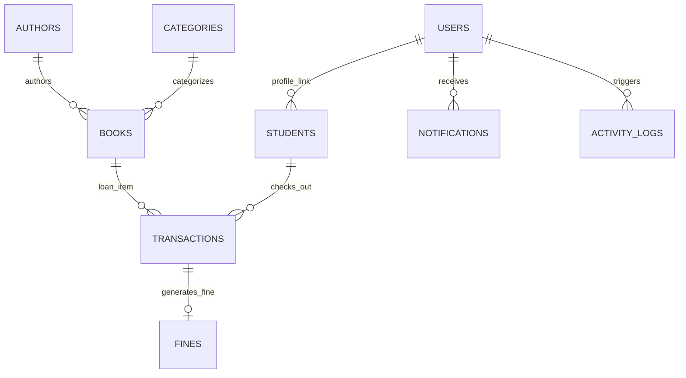

# 📚 Nexus Smart Library Management System

> 🌐 **Live Production Link**: [https://frontend-orpin-sigma.vercel.app](https://frontend-orpin-sigma.vercel.app)  
> *(Mobile, Tablet & Desktop all devices-la open aagum)*

A production-grade, full-stack **Smart Library Management System** designed with a modern SaaS aesthetic, built with **React 18 + Vite + TypeScript + Tailwind CSS** on the frontend and **Python Flask + SQLAlchemy + JWT** on the backend.

---

## 🌟 Key Highlights & Features

- 🎨 **Enterprise SaaS UI/UX**:
  - Crafted inspired by modern tools like Linear, Notion, and Stripe.
  - Smooth transitions, rounded card surfaces, dark/light mode toggle with full contrast preservation, and zero generic template styling.
  - Custom design tokens: Primary (#2563EB), Secondary (#7C3AED), Success (#10B981), Warning (#F59E0B), Danger (#EF4444).
- ⚡ **Full Circulation Lifecycle**:
  - **3-Step Issue Workflow**: Select eligible student $\rightarrow$ live catalog stock verification $\rightarrow$ auto-calculated due date $\rightarrow$ atomic transaction creation and copy reduction.
  - **Return Workflow**: Overdue duration calculator, automated fine assessment formula ($\text{Late Days} \times \$1.50/\text{day}$), instant check-in, and inventory restoration.
- 🛡️ **Role-Based Access Control (RBAC)**:
  - **Admin**: Full administrative permissions, system policy controls (fine rates, borrow quotas, durations), global audit logs.
  - **Librarian**: Circulation management (issue/return), catalog CRUD, student profile maintenance, fee collection & waivers.
  - **Student**: Personalized portal, loan history, active loans with due date countdowns, unread notifications, fine payments.
- 🔔 **Global Toast Notification & Modal Framework**:
  - Centralized `ToastContext` providing non-blocking alerts (Success, Error, Warning, Info) with progress indicators and auto-dismiss.
  - Reusable `ConfirmModal` dialogs preventing accidental deletions and enforcing data integrity.
- 🛡️ **Application Resilience**:
  - Custom `ErrorBoundary` catching view exceptions gracefully with instant recovery options.
- 📊 **Circulation Telemetry & Intelligence (Recharts)**:
  - 6 Key Performance Indicator (KPI) metrics with live status chips.
  - 6-Month monthly circulation volume comparison (Area and Bar charts).
  - Subject category distribution donut chart.
  - Top titles circulation leaderboard.
- 🔍 **Global Command Palette (Ctrl + K)**: Quick jump across books, ISBN numbers, authors, categories, and student records with instant keyboard navigation.
- 📑 **Institutional Reports & Authenticated CSV Export**:
  - One-click audit exports for Books Catalog, Circulation Transactions, Fines Ledger, and Student Rosters.
  - Direct authenticated binary blob download via Axios (no exposed tokens in URL).
  - Browser print view optimization.

---

## 🛠️ Technology Stack

### Frontend
- **Framework**: React 18 with Vite
- **Language**: TypeScript
- **Styling**: Tailwind CSS with custom design tokens (Deep Blue, Violet, Slate)
- **Icons**: Lucide React
- **Charts**: Recharts
- **Routing**: React Router v6
- **HTTP Client**: Axios with JWT Bearer Interceptors & Auto-refresh
- **Feedback**: Toast Notifications (`ToastContext`), Confirmation Modals (`ConfirmModal`), Error Boundary

### Backend
- **Framework**: Python 3.10+ & Flask 3
- **ORM & DB**: Flask-SQLAlchemy with SQLite (zero-config local file) and MySQL compatibility via `DATABASE_URL`
- **Authentication**: PyJWT (HS256) & Werkzeug secure password hashing
- **CORS**: Flask-CORS

---

## 🚀 Quick Start Guide

### Prerequisites
- **Node.js**: v18.0 or higher
- **Python**: v3.10 or higher

---

### 1. Backend Setup & Run

Open a terminal in the project root:

```bash
# 1. Navigate to backend directory
cd backend

# 2. (Optional) Create and activate virtual environment
python -m venv venv
# On Windows:
venv\Scripts\activate
# On Linux/macOS:
source venv/bin/activate

# 3. Install dependencies
pip install -r requirements.txt

# 4. Start Flask server (auto-creates database and populates 25+ realistic books, students, and loans)
python run.py
```
> The API server will run at: **`http://127.0.0.1:5000`**

---

### 2. Frontend Setup & Run

Open a second terminal:

```bash
# 1. Navigate to frontend directory
cd frontend

# 2. Install dependencies
npm install

# 3. Start development server
npm run dev
```
> The web application will be accessible at: **`http://localhost:5173`**

---

## 🔑 Demo Login Accounts (1-Click Switchers Available on Login Page)

The login screen features 1-click switcher buttons for rapid live demonstration and viva:

| Role | Email | Password | Permissions |
| :--- | :--- | :--- | :--- |
| **Admin** 👑 | `admin@smartlib.io` | `adminpassword` | Full system access, policy settings, audit logs, CRUD on all resources |
| **Librarian** 📖 | `librarian@smartlib.io` | `librarianpassword` | Manage catalog, students, issue, return, fee collection & waiver |
| **Student** 🎓 | `alex.chen@university.edu` | `studentpassword` | View catalog, search, own loans, due dates, fines, notifications |

*Note: New student accounts can also be registered directly using the Registration tab with confirm password validation.*

---

## 🗄️ Database Architecture

Normalized relational tables initialized automatically on first startup:



### Business Rules Enforced

1. **Copy Availability**: A book cannot be issued if `available_copies <= 0`.
2. **Atomic Inventory Counters**: Available copies decrease by 1 upon issue and increase by 1 upon return.
3. **Borrowing Quota**: A student cannot exceed their configured `max_borrow_limit` (default: 3 books).
4. **Duplicate Prevention**: A student cannot borrow a second copy of a book they already currently hold.
5. **Automated Due Date**: Automatically set to 14 days from issue date (customizable per loan).
6. **Automated Fine Assessment**: $\text{Fine} = \text{Late Days} \times \text{Fine Per Day}$ (default: \$1.50/day).
7. **Double Return Prevention**: Once a transaction is returned, it cannot be checked in again.
8. **Active Loan Protection**: Books and students with active loans cannot be deleted without clearing loans first.

---

## 📡 REST API Overview

| Method | Endpoint | Description | Auth Required |
| :--- | :--- | :--- | :--- |
| `POST` | `/api/auth/login` | Authenticate user & retrieve JWT token | No |
| `POST` | `/api/auth/register` | Register new student user account | No |
| `GET` | `/api/auth/me` | Fetch authenticated user profile | Yes |
| `PUT` | `/api/auth/profile` | Update profile details and password | Yes |
| `GET` | `/api/books` | Search, filter, and paginate catalog books | No |
| `POST` | `/api/books` | Add new title to library inventory | Librarian/Admin |
| `PUT` | `/api/books/<id>` | Update title metadata or copies | Librarian/Admin |
| `DELETE` | `/api/books/<id>` | Delete book (safe check on active loans) | Librarian/Admin |
| `GET` | `/api/students` | List student directory with loan counts | Librarian/Admin |
| `POST` | `/api/students` | Register student profile | Librarian/Admin |
| `PUT` | `/api/students/<id>` | Update student profile and borrowing quota | Librarian/Admin |
| `DELETE` | `/api/students/<id>` | Delete student profile (safe check) | Librarian/Admin |
| `POST` | `/api/transactions/issue` | Issue book with loan term & quota validation | Librarian/Admin |
| `POST` | `/api/transactions/<id>/return` | Return book with automated fine assessment | Librarian/Admin |
| `GET` | `/api/fines` | Query overdue fines ledger | Yes |
| `PUT` | `/api/fines/<id>/pay` | Record fine payment collection | Librarian/Admin |
| `PUT` | `/api/fines/<id>/waive` | Authorize fine waiver with reason | Librarian/Admin |
| `GET` | `/api/dashboard/stats` | Aggregate circulation telemetry & KPIs | Yes |
| `GET` | `/api/reports/summary` | Institutional metrics overview | Librarian/Admin |
| `GET` | `/api/reports/export-csv` | Download CSV audit exports | Librarian/Admin |
| `GET` | `/api/search/global` | Omnisearch across books, authors, students | Yes |
| `GET` | `/api/settings` | Retrieve library operational settings | Yes |
| `PUT` | `/api/settings` | Update policy rules (fine rate, limits) | Admin |

---

## ⚙️ Environment Variables (`.env`)

```ini
SECRET_KEY=smart-library-super-secret-key-2026-prod
JWT_SECRET_KEY=jwt-super-secret-key-change-in-production
DATABASE_URL=sqlite:///library.db
PORT=5000

# Business Rules Defaults
DEFAULT_BORROW_DAYS=14
DEFAULT_FINE_PER_DAY=1.50
DEFAULT_MAX_BORROW_LIMIT=3
LIBRARY_NAME="Nexus Smart Library"
```

---

## 🔮 Future Enhancements
- 📱 Barcode and RFID scanner hardware integration via WebUSB/Camera.
- 📬 Automated email dispatches via SendGrid / SMTP for overdue reminders.
- 💳 Online payment gateway integration (Stripe / Razorpay) for digital fine payment.
